# CMPE283 : Virtualization 
# Assignment 2:  Instrumentation via hypercall
- Your assignment is to modify the CPUID emulation code in KVM to report back additional information when special CPUID leaf nodes are requested.
  - For CPUID leaf node %eax=0x4FFFFFFC:
    - Return the total number of exits (all types) in %eax
  - For CPUID leaf node %eax=0x4FFFFFFD:
    - Return the high 32 bits of the total time spent processing all exits in %ebx
    - Return the low 32 bits of the total time spent processing all exits in %ecx
        - %ebx and %ecx return values are measured in processor cycles, across all VCPUs
    
#### 1. For each member in your team, provide 1 paragraph detailing what parts of the lab that member  implemented / researched. (You may skip this question if you are doing the lab by yourself).
- *Sirisha Polisetty(016012477)*
  - Created VM on google cloud compute engine using cloudshell.
  - Build the kernel and installed new modules and reloaded the kernel.
  - Researched about code changes that are required to implement cpuid `0x4FFFFFFC` and `0x4FFFFFFD` and made code changes in vmx.c
  - complied new changed code and installed modules using `rmmod` and `modprobe` to vm.
  - Launched the VM on hypervisor using qemu-system.
  - Created test_assignment.c to test the changed hypercall `cpuid` and compiled it.
  - Tested the new cpuid hypercall using compiled test code `./test_assignment2` and documented compiled program and `dmesg` output.
  - committed required screenshots to the github and contirbuted to Readme.md
- *Jayanth Vishal Reddy Godi (016720080)*
  - Enabled SSH Authentication on VM launched on google cloud using ssh keys.
  - Installed required dependencies on launched VM for building kernel and launching virtual machine on hypervisor.
  - Researched about code changes that are required to implement cpuid `0x4FFFFFFC` and `0x4FFFFFFD` and made code changes in cpuid.c
  - Upgraded the ubuntu OS to latest using apt-get update and apt-get upgrade
  - Researched about ways to launch vm on kernel. Tried out virt-manager and qemu-system and decided to go ahed with qemu-system
  - Reloaded new modules in the kernel for `kvm` and `kvm_intel`
  - tested cpuid functionality using `cpuid -l 0x4FFFFFFC` and `cpuid -l 0x4FFFFFFD` and documented output
  - committed `dmesg` output to the github and contirbuted to Readme.md

#### 2. Describe in detail the steps you used to complete the assignment. Consider your reader to be someone  skilled in software development but otherwise unfamiliar with the assignment. Good answers to this  question will be recipes that someone can follow to reproduce your development steps. Note: I may decide to follow these instructions for random assignments, so you should make sure  they are accurate.

### Step 1 
- Created a VM on gcloud using the insturctions that are required for creating a virtualization machine with virtualization capabilities enabled.
- use cloud shell commmand to get the details about the account from google compute engine
- add additional details to the cloud shell command to launch instance using instructions provided.
- generate ssh key on your local machine if it not exits `ssh-keygen -t ed25519`
- Final cloud shell command with all the vm capabilitis with your ssh keys in metadata.
```
gcloud compute instances create cmpe283-assignment2 --project=valued-network-366918 --zone=us-central1-a --machine-type=n2-standard-8 --network-interface=network-tier=PREMIUM,subnet=default --metadata=ssh-keys=jayanthvishalreddy:ssh-ed25519\ AAAAC3NzaC1lZDI1NTE5AAAAIHsTFWuRw6DNxrrQgBiIx9TSgrOtdVNEoO1aWPfbHnfs\ jayanthvishalreddy@Jayanths-MacBook-Air-2.local$'\n'siri:ssh-ed25519\ AAAAC3NzaC1lZDI1NTE5AAAAICMdhjaZM4SHxu6BC7LYeX6r6yL48fbF5D\+MFwMU4w5j\ sirishacyd@gmail.com --maintenance-policy=MIGRATE --provisioning-model=STANDARD --service-account=1044074668714-compute@developer.gserviceaccount.com --scopes=https://www.googleapis.com/auth/devstorage.read_only,https://www.googleapis.com/auth/logging.write,https://www.googleapis.com/auth/monitoring.write,https://www.googleapis.com/auth/servicecontrol,https://www.googleapis.com/auth/service.management.readonly,https://www.googleapis.com/auth/trace.append --create-disk=auto-delete=yes,boot=yes,device-name=cmpe283-assignment1,image=projects/ubuntu-os-cloud/global/images/ubuntu-2204-jammy-v20221018,mode=rw,size=100,type=projects/valued-network-366918/zones/us-central1-a/diskTypes/pd-balanced --no-shielded-secure-boot --shielded-vtpm --shielded-integrity-monitoring --reservation-affinity=any --min-cpu-platform "Intel Cascade Lake" --enable-nested-virtualization
```
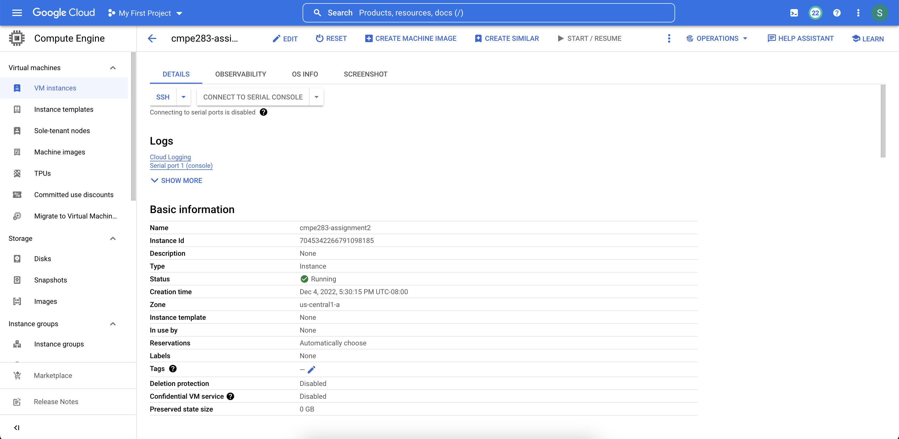
- Launched Instance with the SSH Keys Metadata added.

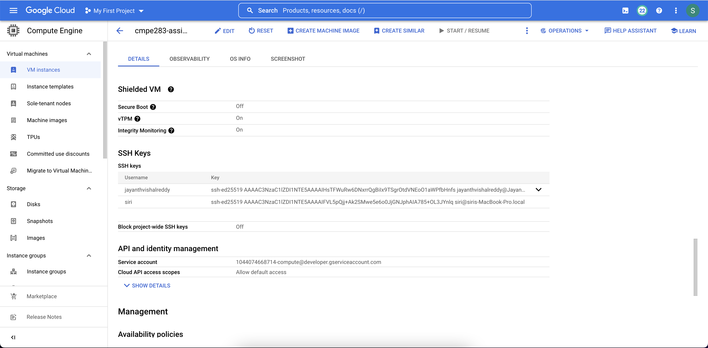

- We can Login to the launched instance using two methods
    - ssh connect from the google compute engine [instances](https://console.cloud.google.com/compute/instances) page. Connected instance through SSH, launched on a web browser.
    
    - ssh connect to the instance where the private key exist for the public key that has been added for your users.
    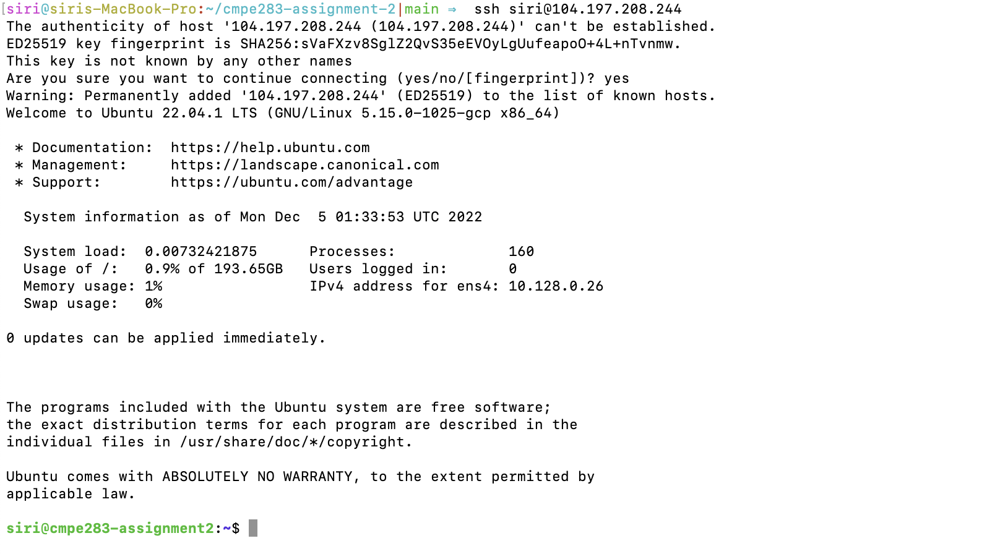
    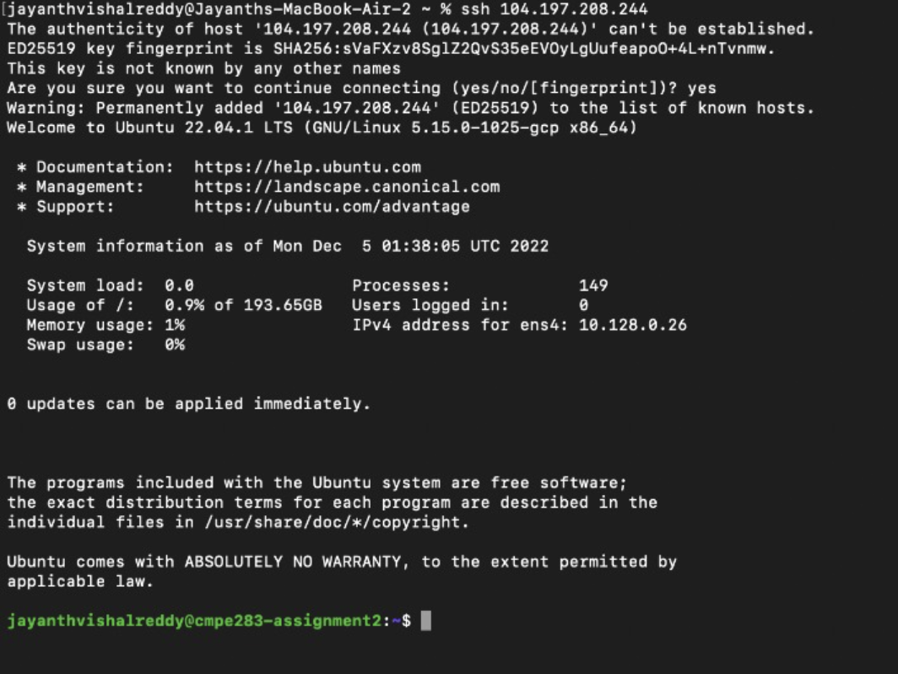

### Step 2 
- Installed required dependencies to perform the assignment that can help to build kernel from source code with changes for our assignment and Launch a New VM on Kernel we are building with changes for a hyper call.
```
sudo apt-get update
sudo apt-get upgrade
sudo apt-get install vim gcc make linux-headers-$(uname -r)
sudo apt-get install git fakeroot build-essential ncurses-dev xz-utils libssl-dev bc flex libelf-dev bison
sudo apt update && sudo apt install qemu-kvm -y
sudo apt-get install cloud-image-utils
```
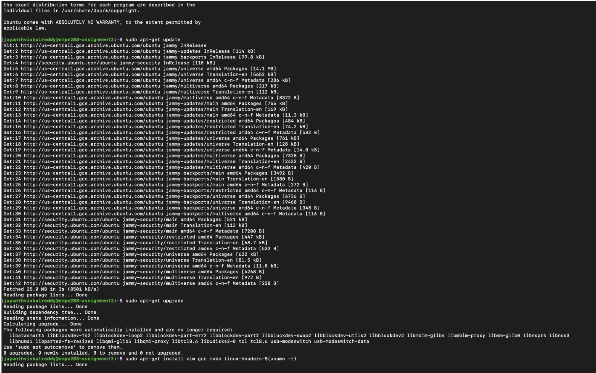

### Step 3
- Download and Build `linux-6.0.7` source code
```
wget https://cdn.kernel.org/pub/linux/kernel/v6.x/linux-6.0.7.tar.xz
tar xvf linux-6.0.7.tar.xz
cd linux-6.0.7
cp -v /boot/config-$(uname -r) .config
```
- Note : Fix `No rule to make target 'debian/canonical-certs.pem'` by the following commands
  - `scripts/config --disable SYSTEM_TRUSTED_KEYS`
  - `scripts/config --disable SYSTEM_REVOCATION_KEYS`
- Build the kernel source code using the following commands
```
sudo make -j <number_of_cpu_cores> modules
sudo make -j <number_of_cpu_cores>
sudo make -j <number_of_cpu_cores> modules_install
sudo make -j <number_of_cpu_cores>install
```
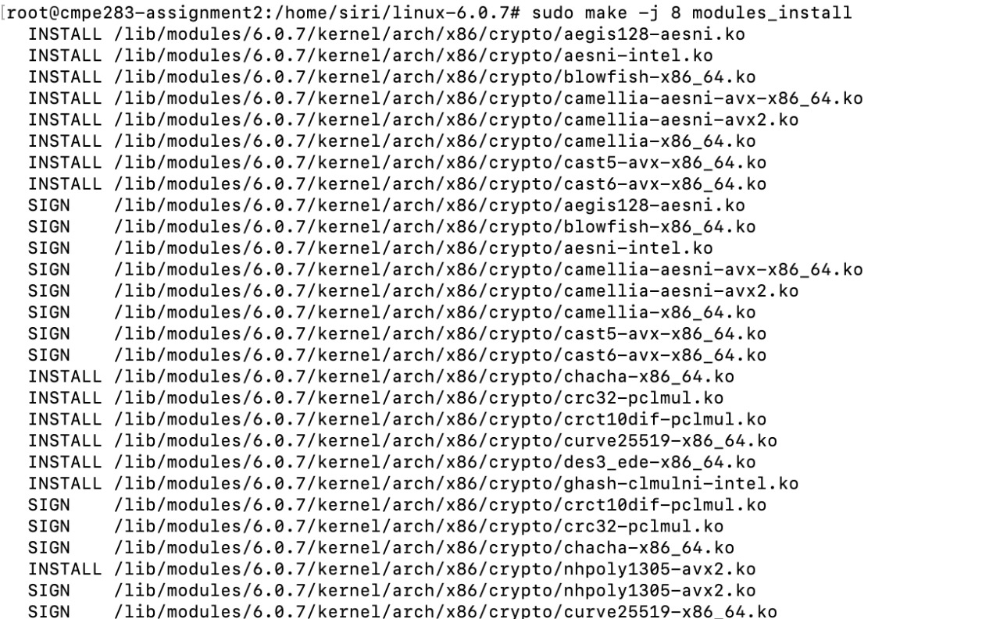 
- After `make -j <number_of_cores> install` the bootloader is automatically updated.
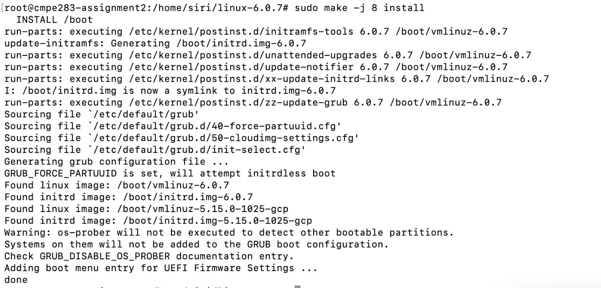

- We can ensure that the kernel has been updated by the `sudo reboot` and `uname -mrs`.
  - Output should be `Linux 6.0.7 x86_64`
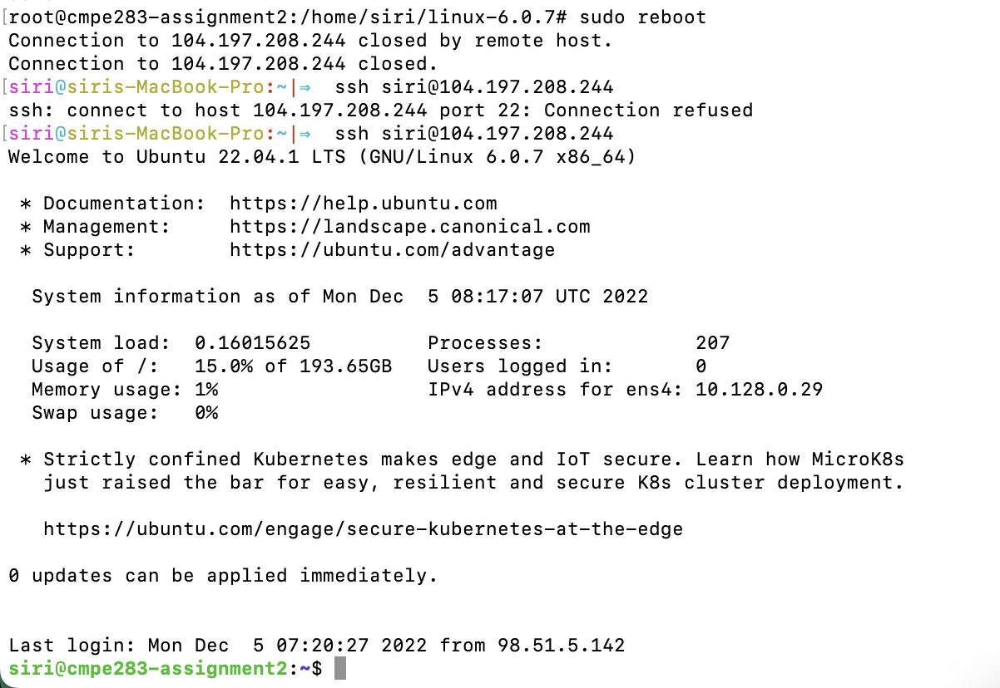
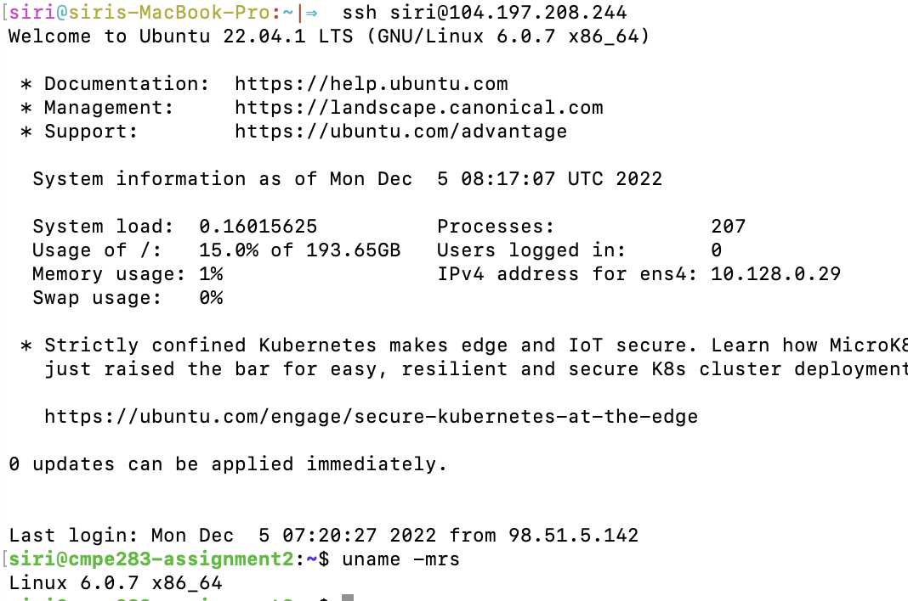

### Step 4
- Make Code Changes to Implement Functionality for leaf nodes 0x4FFFFFFC and 0x4FFFFFFD and rebuild kernel
- vmx.c: [`linux-6.0.7/arch/x86/kvm/vmx/vmx.c`](arch/x86/kvm/vmx/vmx.c)
- cpuid.c: [`linux-6.0.7/arch/x86/kvm/cpuid.c`](arch/x86/kvm/cpuid.c)
- Rebuild change modules using `make -j <number_of_cores> modules` 
- Install New Modules in to kernel using `make -j <number_of_cores> INSTALL_MOD_STRIP=1 modules_install`
- Reload kvm and kvm_intel modules
  - `sudo rmmod kvm_intel`
  - `sudo rmmod kvm`
  - `sudo modprobe kvm_intel`
  - `sudo modprobe kvm`

### Step 5
- Launch an instance on host kernel using the following commands and setup
- Get Image for launching VM using `wget https://cloud-images.ubuntu.com/bionic/current/bionic-server-cloudimg-amd64.img` 
- Create `user-data` file with following contents.
```
#cloud-config
password: newpass #new password here
chpasswd: { expire: False }
ssh_pwauth: True
``` 
- Run `cloud-localds user-data.img user-data`
- Launch an VM using `sudo qemu-system-x86_64 -enable-kvm -hda bionic-server-cloudimg-amd64.img -drive "file=user-data.img,format=raw" -m 512 -curses -nographic --accel`
- Login to VM using username `ubuntu` and password `newpass`
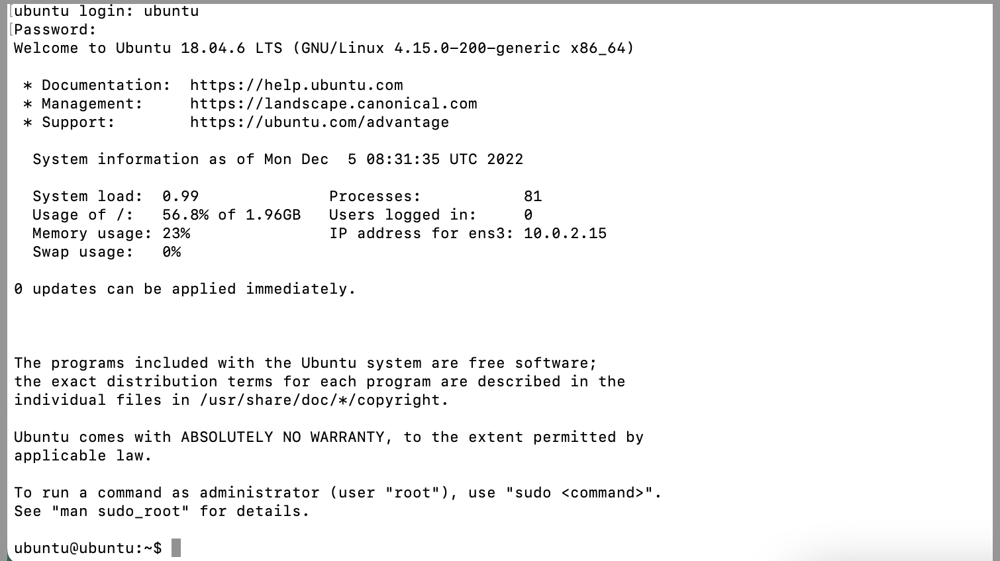
### Step 6 
- Testing CPUID on the VM and Observing Behavior on the Host Modified Kernel for Hypercall
- Install required items on host vm for observing behavior of cpuid hypercall `sudo apt-get update` and `sudo apt-get install cpuid`
- Testing for `cpuid -l 0x4FFFFFFC`
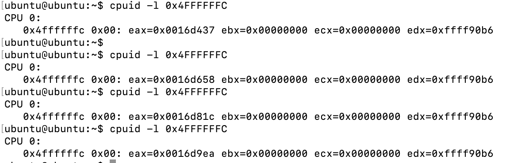
- dmesg output for `cpuid -l 0x4FFFFFFC`
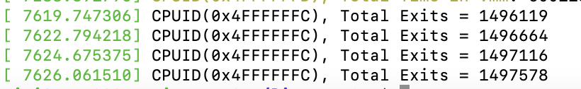 
- Testing for `cpuid -l 0x4FFFFFFD`
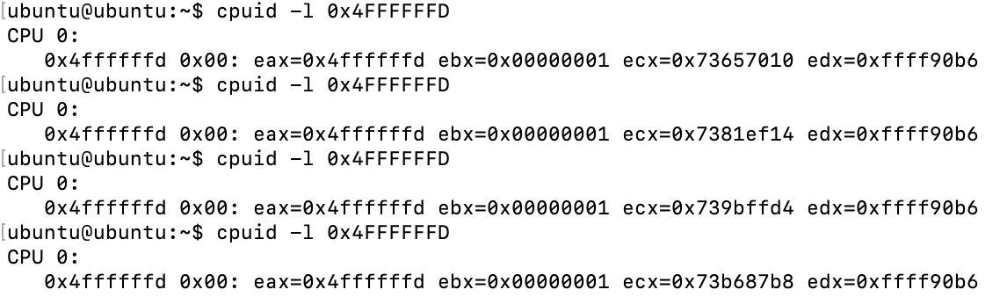
- dmesg output for `cpuid -l 0x4FFFFFFD`
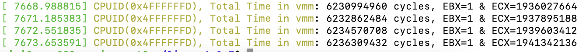 

### Step 7
- Testing using Test Script created for assignment 2
- Created usermode program [test_assignment2.c](./test_assignment2.c) on Launched VM
- compile the c program using `gcc -o test_assignment2 test_assignment2.c`
- execute the program using compiled code `./test_assignment2` on launched VM
- execute the program using compiled code `./test_assignment2`
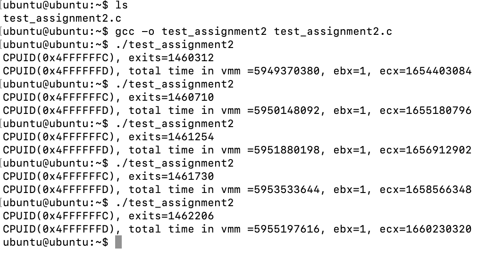 
- check `sudo dmesg` output to observe the kernel logs on kernel machine
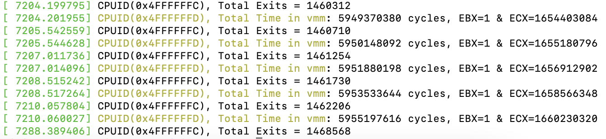 
